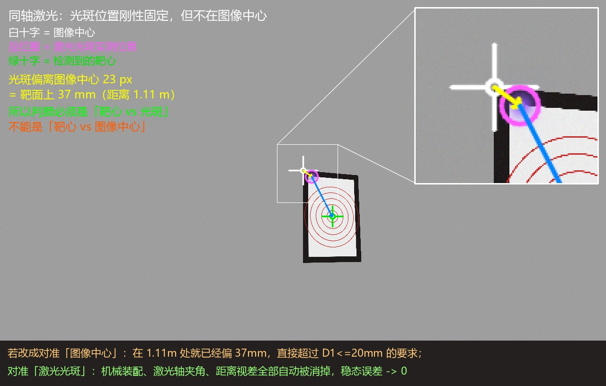
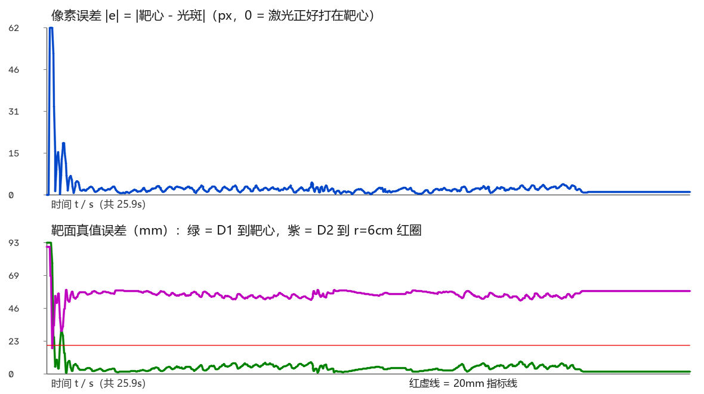

# 机载计算机（地瓜派）视觉瞄准程序 —— 设计大纲

对应赛题：2025 全国大学生电子设计竞赛 本科组 E 题「简易自行瞄准装置」
对应代码：`rdk_aim/`（本目录）

---

## 零、三个算力节点，各干什么、不干什么

```
   RCT6 (STM32F103RCT6)          地瓜派 (RDK / Ubuntu)            H723 (STM32H723VGT6)
  +--------------------+      +------------------------+     +----------------------+
  | 灰度巡线            |      | 相机取图                |     | BMI088 姿态解算       |
  | 电机闭环            | UART | 找靶心 / 找光斑          |UART | 双轴稳定环            |
  | 拐角检测、圈计数     |<---->| 角度偏置解算             |<--->| 电机速度环(驱动器内)   |
  | 灰度/速度/进度上报   |      | 状态机 / 计时 / 日志     |     | 激光开关 IO           |
  +--------------------+      +------------------------+     +----------------------+
                                       |
                              USB / MIPI 相机 + 同轴 405nm 激光
```

| 节点 | 职责 | **明确不做** |
|---|---|---|
| RCT6 | 循迹、电机、圈数、拐角事件 | 不碰云台、不碰视觉 |
| 地瓜派 | 视觉检测、瞄准解算、任务状态机、计时 | **不碰电机电流**、不做姿态解算 |
| H723 | 姿态稳定、双轴位置/速度环、激光 IO | **不做视觉**、不做路径规划 |

分工的唯一判据是**延迟**：电机环要 200Hz+ 且不能被 Linux 调度抖动污染 → 必须在 MCU；
视觉是 30~60Hz 且算力需求大 → 必须在机载计算机。
中间用"角度偏置"这个**低频、小带宽**的量连接，所以串口延迟（1~5ms）完全不成问题。

---

## 一、核心控制思想：把「打中靶心」变成「两个像素点重合」

### 1.1 同轴激光的关键性质

激光和相机**刚性固连**（同轴装配）。设相机转过 θ：

- 靶心是**世界里的物体** → 相机转 θ，它在图像里往反方向移动 `fx·θ` 像素
- 激光光斑是**固连在相机上**的 → 相机转 θ，光斑在世界里正好移动同样多，
  于是相机看到的它**一动不动**

> **结论：激光光斑在图像里的位置是一个常数，与云台角度、与靶的距离都无关。**
> 它就是"光轴点"（boresight）。



上图是仿真里实测的一帧（不是示意图）：白十字是**图像中心**，
品红圈是**激光光斑实测位置**，两者差了 23px —— 在 1.11m 处就是**靶面上 37mm**。
如果按"把靶心对到图像中心"来做，**一开始就已经超过 D1<=20mm 的要求**。
只有把靶心对到**光斑**上，机械装配、激光轴夹角、距离视差才会全部被自动消掉。

于是：

```
  激光打中靶心   <==>   光斑像素 == 靶心像素
```

### 1.2 为什么这个等价关系如此重要

如果反过来做（"算出靶心的世界角度，再命令云台转过去"），必须精确知道：

1. 相机光心与云台偏航轴、俯仰轴的相对位置与夹角
2. 激光轴与相机光轴的夹角（典型 0.1°~1°，逐台不同）
3. 靶面到车的距离

这三件事任何一件不准，都会**直接变成瞄准误差**，而且它们无法用一次标定永久固定
（装配应力、温度、振动都会变）。

用像素闭环则**全部绕开**：误差就是要控制的那个量本身，测出来直接消掉。
机械装配只影响"收敛快慢"，不影响"最终准不准"。

### 1.3 增益天然已知：不需要标定就能得到正确的开环增益

小孔成像模型，角度 θ 与像素位移的关系：

```
Δu = fx · tan(θ)   ≈   fx · θ      (θ 小)
```

所以"把光斑挪 e 个像素需要转多少度"，答案就是 `θ = e / fx`（fx 由内参标定给出）。

- 与靶的距离**无关**（纯转动不改变距离）
- 与靶在画面里的位置**基本无关**（小角度）

这让控制器结构极其简单：**一个增益的积分型视觉伺服**。

### 1.4 激光看不见时的兜底

若相机 IR-cut 滤掉了 405nm、或光斑被过曝掩盖，就用标定好的 `boresight_uv`
常数代替光斑位置（因为它是常数，标定一次永久有效）。见 `laser.gate_enable`。

---

## 二、视觉：怎么找到靶心

### 2.1 不用红点直接找 —— 为什么

赛题里靶心是"红色油性记号笔点的一个点，**直径 ≤0.1cm**"。

| | 靶心红点 | 黑胶带外框 |
|---|---|---|
| 物理尺寸 | ≤1mm | 180mm x 297mm，带宽 18mm |
| 1.5m 处成像 | **≈0.5 像素**（不可见） | 黑框面积占比 15% 以上 |
| 对比度 | 还好，但太小 | 黑/白，极高 |
| 稳定性 | 噪声、光照影响大 | 极大、极稳 |

**所以主检测目标是黑框四边形，不是红点。**

### 2.2 主检测链路

```
灰度 -> 自适应阈值(取反) -> 形态学闭运算 -> findContours
   -> 面积筛选 -> approxPolyDP 拟合四边形
   -> 凸性 / 最小边长 / 「透视矫正后像不像 A4」打分
   -> 择优 -> 计算单应矩阵 H（靶面 mm 坐标 <-> 图像像素）
```

**"像不像 A4"是有效判据**：把候选四边形透视矫正成矩形后，长宽比必须接近
297:210 = 1.414（允许 `aspect_tol`），而且矫正图里应当呈现
"外圈黑带 + 内部亮面"的结构。场地里没有别的这种图案，误检概率极低。

> **二值化只用自适应阈值，不要用 Otsu**（实测踩过）。
> Otsu 是全局阈值：一旦把场地背景也判成"暗"，背景就会和黑框粘成一整块，
> 外轮廓变成整幅图像、被面积上限滤掉，检测直接归零。
> 而靶纸是**"框"结构**，只要黑框的**边界**被检测到就够了
> （形态学闭运算会把边界连成闭环）。自适应阈值天生只看局部对比，
> 背景再亮再暗都能拿到边界。
> `adaptive_block` 必须**大于黑胶带在图像里的像素宽度**（近了会到 20~40px），
> 否则胶带内部被判成"背景"，边界就断了。

### 2.3 亚像素精修：红圈质心

黑框中心已能给出靶心，但精度受黑框边缘量化误差限制。
在**透视矫正后的正视图**里再做一次红色掩膜（5 个同心红圈 + 靶心点），
求**红色像素的加权质心**：

- 红圈的几何分布关于靶心**四重对称**，所以即使外圈（r=10cm）被黑胶带
  遮住一部分，只要左右/上下**对称地被遮**，质心仍严格落在靶心
- 亚像素精度：几万个红色像素求质心，理论精度远优于 0.1 像素

再与黑框中心**交叉校验**（偏差 > `red_center_tol_px` 就丢弃精修结果），
避免把别处的红色干扰当成靶心。

### 2.4 兜底检测

黑框检测失败时（靶只露出一部分、临时逆光），退化为"直接找红圈"：
红色掩膜 → 最大连通域 → `minEnclosingCircle` 圆心。
精度差但保证"不完全丢失"，由 `target.fallback_red` 控制。

### 2.5 输出内容

```python
TargetResult(
    uv        = (u, v),      # 靶心像素坐标  <- 瞄准环要用
    quad      = 4x2,         # 黑框四角
    H         = 3x3,         # 靶面 mm <-> 像素（画圆要用）
    distance_m,              # 由靶纸已知尺寸反推的距离
    confidence,              # 0~1
    source    = 'quad'|'red',
)
```

---

## 三、光斑检测

### 3.1 判据

405nm 蓝紫激光在彩色相机里表现为"**B 通道远大于 R/G，且亮度极高**"：

```
mask = (B >= b_min) & (B - max(R,G) >= b_minus_others)
```

与红色干扰的区别是方向性的：红色是 **R 占优**，激光是 **B 占优**，不会混。

### 3.2 位置门控（本方案特有的强先验）

由 §1.1，光斑位置**刚性固定**。所以：

> 只在已知光斑位置附近 `gate_radius_px` 内接受候选，其它一律拒绝。

这一条把"白色反光、纸面高光、别的光源"这类误检基本一网打尽。
刚上电还没学到光斑位置时用放宽半径 `gate_relax_px`，第一次找到后自动收紧。

### 3.3 亚像素

在候选连通域内用 `(B - 基线)` 加权求质心 → 亚像素精度。

---

## 四、瞄准控制器

### 4.1 控制律

```python
e        = target_uv_lead - spot_uv          # 像素误差（含超前补偿）
dtheta   = e / px_per_deg                    # px_per_deg = fx * pi / 180
offset  += kp * dtheta                       # 单增益积分型视觉伺服
```

**为什么"累加"就够了**：`offset` 是角度的积分，而 `dtheta` 是"这一帧还差多少角度"。
每次把还差的角度乘一个系数累加进命令，等价于一个 **I 型（一阶无静差）系统**：
稳态时 `e -> 0`，即激光严格落在靶心上，**不依赖任何增益标定精度**。

### 4.2 增益怎么选（唯一需要调的旋钮）

把整环抽象成"测量 → 计算 → 执行 → 再测量"的单回路，一帧纯延迟时特征方程
`z^2 - z + kp = 0`：

严格推导：开环传递为 `kp/(z-1)` 再延迟 `D` 帧。
相位 = -90°（积分器）- ωT/2（积分器的相位亏损）- D·ωT，
令相位 = -180° 得 `ωT = 90°/(D+0.5)`，此处环路增益为
`kp / (2·sin(ωT/2))`，所以

```
kp_stable < 2 · sin( 45° / (D + 0.5) )
```

其中 **D = 环路总延迟帧数**（曝光 + 处理 + 串口 + 驱动器 + 采样回路本身 1 帧）。

| D（帧） | kp 上限 | 对应场景 |
|---|---|---|
| 2 | 1.00 | 60fps、短曝光、算力充裕 |
| 3 | 0.52 | 60fps 的常态 |
| **4** | **0.35** | 30~40fps 的常态（**PC 仿真实测 0.33 起振，吻合**） |
| 5 | 0.28 | 分辨率高 / 算力紧张 |
| 6 | 0.24 | 最差情况 |

**默认 `kp = 0.20`**：即使 D=6 也稳，D=4 时有 1.75 倍增益余量。
现场确认不抖、只是嫌慢时，按上表每次 +0.05 往上加。
**这个环只有一个旋钮，别去动别的东西。**

> 实测教训：一开始设 0.35，仿真里误差以约 0.5s 周期持续振荡不衰减。
> 原因是主循环比相机快，**同一帧误差被重复积了好几次**，等效增益直接翻 5 倍。
> 修法是"一帧只积分一次"（`new_frame` 判据）。这类 bug 真机上同样会出现，
> 而且很难从现象反推，务必记住。

### 4.3 超前补偿（抵消延迟）

延迟会让"运动中的靶"永远滞后一个固定距离：

```
e_lead = e + T_lead * e_dot        T_lead ≈ 总延迟（默认 45ms）
```

`e_dot` 由 α-β 滤波器从靶心像素序列里估出（`estimator.py`）。
`T_lead` 只能取到"延迟量级"，取太大反而引入振荡，所以 `lead_gain` 默认 1.0，
允许现场降到 0.5。

### 4.4 保护与限幅

| 保护 | 参数 | 作用 |
|---|---|---|
| 死区 | `deadband_px` | 误差 <3px 不动作，抑制像素抖动 |
| 变化率限幅 | `rate_limit_dps` | 重捕获瞬间不猛冲（保护机械与电缆） |
| 行程限幅 | `max_yaw_deg` / `max_pitch_deg` | 不撞机械、不拉断线 |
| 丢失滑行 | `lost_coast_s` | 短时丢失保持上次偏置（惯性连续） |
| 拐角加强 | `kp_corner` | RCT6 报拐角时临时提高增益/预测 |

### 4.5 拐角为什么需要特殊处理

小车过拐角时航向在 0.3~0.5s 内变 90°，云台偏航电机必须以约 180°/s 反向跟随
（稳定环要保持绝对方位不变）。这段时间：

1. 图像里靶心会快速横向掠过 → 有效延迟被放大
2. 车体振动 → 相机抖动 → 检测置信度下降

**拐角的物理本质是"目标像速度方向突变"**：拐角前靶面像速度是"横向掠过"，
拐角后变成"远离"，方向直接变 90°，等于给超前补偿灌进一个完全错误的速度。
所以地瓜派做两件事：

1. `kp` 提到 `kp_corner`，但**只提 1.3~1.6 倍**（拐角本来就容易振）
2. **把超前补偿压到 35%**（`corner_lead_scale`）—— 速度估计此刻不可信，
   硬用旧速度超前反而把误差推大

实测：不做处理时拐角落点偏差峰值 **24mm**（已超 D1<=20mm）；
加上"降超前 + 温和增益"后降到 **8mm**。
**这是 RCT6 与地瓜派通信最核心的用途。**

---

## 五、状态机

```
        +--------------+
        | BOOT_WAIT    | 等 H723 走完启动状态并回报 telemetry
        +------+-------+
               | gimbal.state == RUNNING
        +------v-------+  扫不到/超时
        | ACQUIRE      |---------------> FAULT
        | 扫描找靶      |
        +------+-------+  检测到靶
        +------v-------+
        | LOCK         | 视觉伺服收敛到 |e| < tol
        +------+-------+
        +------v-------+  RCT6 报"开始行驶"
        | TRACK        |<-----+
        +------+-------+      |
               | 画圆使能      |
        +------v-------+      |
        | DRAW         |------+  圈数完成
        +------+-------+
               |
        +------v-------+  目标短时丢失
        | LOST         |  coast -> 小范围重搜 -> 全周重扫
        +--------------+
```

每个状态的**进入动作 / 退出条件 / 超时 / 降级**都在 `eaim/state_machine.py`
里显式写出，并且每条转移都带日志，现场"卡在哪一步"一眼可见
（沿用你 H723 固件里那套打印排查思路）。

---

## 六、扫描捕获（基本要求 2 只有 2s）

### 6.1 时间预算

| 阶段 | 预算 |
|---|---|
| H723 启动（**当前 3.4s，是最大风险**） | 0 |
| 扫描捕获 | <=1.0s |
| 伺服收敛到 abs(e) < 2px | <=0.5s |
| 激光已在发光，无需等待 | 0 |
| **合计** | **<=1.5s** |

### 6.2 策略：先水平整圈（单调绕圈），再逐层加俯仰

`step_deg` 取相机水平视场的 2/3 左右（fx=640@1280 宽 → 视场 90° → 取 60°）。
水平层绕一整圈的顺序是

```
0° -> +60° -> +120° -> 180° -> -120° -> -60°
```

**为什么不用"从中心向外"的交替顺序**：交替扫的总行程是
`60+120+180+240+295+350 = 1245°`，按 260°/s 要 4.8s，2s 预算里根本跑不完；
单调绕圈总行程只有 **360°**，1.38s 转完，加上 7×70ms 停留 = 0.49s，
**整圈 1.87s，能塞进 2s**。而第一帧（yaw=0）本身就覆盖 ±45°，
只要车大致朝着靶，往往第一个点就命中。

然后按 |pitch| 逐层加俯仰（±35°），用于"任意瞄准方向"的场景。

> 一个反直觉的实测结论：**扫描不是越快越好**。
> 判定"到没到"必须等到画面稳定（`settle_ms`），
> 否则运动模糊会把黑框边缘糊掉，反而漏检。

### 6.3 若时间不够

按优先级砍：① 减小 `dwell_ms`；② 改连续扫（不停顿，用高帧率 + 运动模糊容忍）；
③ 降分辨率换帧率。**不要砍 H723 的启动信号时序**，见风险文档。

---

## 七、画圆（发挥部分 3）

### 7.1 目标

激光沿靶面上 **r=6cm 的红圈**画一圈；小车跑 1 圈 = 画 1 圈；
`D2 <= 2cm`；同步误差 < 1/4 圈。

### 7.2 激光门控（必须做，否则直接超 D2）

裁判量的是"光斑痕迹到 r=6cm 红圈的最大距离"。有两个坑：

1. 瞄准阶段打靶心 → 靶心会留下一个 **6cm 外**的孤立深斑，单独就超差
2. 从靶心挪到圆周的过程 → 画出一条**径向拖痕**，也超差

所以画圆模式必须**起跑前全程关激光**（`draw.laser_gate`），起跑瞬间才点亮。
代价是瞄准阶段只能用"标定好的光轴点"当光斑位置 ——
所以**跑画圆之前一定要先做 `tools/calib_boresight.py`**。
程序在缺少光轴点时会自动关闭门控并打印告警（宁可留痕，也不能瞎跑）。

另外起跑前会先把光斑挪到圆的起点，**误差进入 10px 就发车**（最多等 0.8s），
这样起步瞬间 D2 就已经在范围内。

### 7.3 做法：复用同一个像素环，只把设定点改成动点

```
靶面坐标(纸面mm)  p(phi) = 圆心 + r*(cos phi, sin phi)   <- 已知量，不用视觉
        |  H（黑框给出的单应矩阵，见 2.2）
        v
图像像素设定点    sp(phi) = H * p(phi)
        |  喂给第四节同一个控制律
        v
云台角度偏置
```

**关键优势：`D2` 天然约等于 0**。因为我们画的圈**就是**那条红圈的数学方程，
不是"凭感觉画个圆"。视觉环只负责让光斑咬住这个移动设定点，
所以最终误差 = 跟踪误差，而不是"画得像不像圆"。

### 7.4 同步怎么做（<1/4 圈的保证）

三种相位来源，由 `draw.phase_source` 选择：

| 来源 | 精度 | 说明 |
|---|---|---|
| `corner`（默认） | 高 | RCT6 每过拐角上报一次 -> 相位重同步到最近的 k/4 圈；中间按实测单圈时间插值 |
| `car_phase` | 最高 | RCT6 直接上报 0~1000 的归一化进度（若固件能做） |
| `time` | 中 | 纯按 `lap_time_s` 计时，只用于调试 |

**关键实现细节**：参考相位必须是一个**随时间自由推进的时钟**
（`参考值 = 上次同步点 + 经过时间 / 单圈时间`），拐角事件只负责把它拉回 `k/4`。
一开始写成"把相位直接拉向固定的 k/4"，结果刚 seed 完 `phase=0/target=0`，
误差恒为 0，相位就**卡死在 1/4 圈不动**（实测踩过）。
另外纠偏只能改相位的**速度**（限速 0.5 圈/秒），不能直接改位置，
否则设定点会瞬移、激光在靶面上画出台阶。

1/4 圈 = 5s（20s 单圈）的容差，`corner` 模式每个拐角都硬同步一次，
实测同步误差 **0.6% 圈**，比指标宽 40 倍。

### 7.5 方向与起点

`direction: ccw/cw` 与小车绕行方向一致；`phase_offset` 调整起点，
让"小车在某拐角"对应"光斑在圆的某个位置"（现场标定一次即可）。

---

## 八、通信协议

统一帧格式（两条链路共用 `eaim/protocol.py`）：

```
AA 55 | msg_id(1) | seq(1) | len(1) | payload(len) | crc16_lo crc16_hi(2)
                   +------------ CRC16/Modbus 覆盖这一段 ------------+
```

固定帧头 + 长度 + CRC：串口粘包/断包/干扰都能可靠识别，
比 ASCII 行协议快得多（100Hz x 小帧无压力）。

### 8.1 地瓜派 <-> H723

| 方向 | ID | 名称 | 内容 |
|---|---|---|---|
| 下行 | 0x10 | `AIM` | yaw偏置、pitch偏置（0.01°）、flags(激光/有效/加强/画圆) |
| 下行 | 0x11 | `MODE` | IDLE / STAB / AIM / UNWIND / ESTOP |
| 下行 | 0x12 | `HEARTBEAT` | 心跳 |
| 下行 | 0x13 | `SET_ZERO` | 把当前朝向记为偏置零点 |
| 上行 | 0x90 | `STATE` | 状态、故障码、IMU姿态、电机角度、陀螺、偏置回显 |
| 上行 | 0x91 | `ACK` | 指令应答 |

### 8.2 地瓜派 <-> RCT6

| 方向 | ID | 名称 | 内容 |
|---|---|---|---|
| 下行 | 0x20 | `CAR_CMD` | 启动/停止/设定圈数/计时清零/速度比例 |
| 下行 | 0x21 | `AIM_STATE` | 是否锁定、质量、当前模式（给小车做联锁或降速） |
| 上行 | 0x92 | `CAR_STATE` | 状态、圈号、当前段、段内进度、灰度、速度、单圈时间 |
| 上行 | 0x93 | `CAR_EVENT` | 拐角 A/B/C/D 通过、单圈完成 |

逐字节定义见 [`01_通信协议.md`](01_通信协议.md)。

### 8.3 失效保护

- 地瓜派 -> H723：`telemetry_timeout_s`（默认 0.5s）内没收到 `STATE` 就
  把模式降回 `STAB` 并关激光（**云台自身仍有稳定能力，不会乱转**）
- H723 侧同样：`AIM` 断流 > 0.5s 就冻结偏置、保持最后角度
- RCT6 掉线：不影响瞄准，只是失去拐角增强与画圆相位

---

## 九、标定与工具链

| 工具 | 作用 | 频率 |
|---|---|---|
| `tools/calib_intrinsic.py` | 棋盘格标内参（fx/fy/cx/cy/dist） | 装镜头后一次 |
| `tools/calib_boresight.py` | 标 **光轴点**（激光落点像素）+ 自动判定 yaw/pitch 符号 | 每次拆装后一次 |
| `tools/check_laser.py` | 验证"激光在画面里能不能被检测到"（决定是否走兜底） | 装配后一次 |
| `tools/view_detect.py` | 可视化调检测阈值，实时看靶心/光斑/误差 | 现场常用 |
| `tools/fake_gimbal.py` | 假 H723，PC 上模拟协议对端，验证链路 | 联调时 |
| `main.py sim` | **PC 上全闭环仿真**（合成靶纸 + 云台执行器 + 小车运动） | 每次改算法后 |

标定结果统一写进 `configs/*.yaml`，程序启动时加载并校验。

---

## 十、工程结构

```
rdk_aim/
├── main.py                 入口：run / sim / replay / check / unwind
├── configs/                参数（default.yaml 带中文注释）
├── eaim/
│   ├── config.py           配置加载（YAML，缺 PyYAML 时有内置回退解析器）
│   ├── simple_yaml.py      极简 YAML 子集解析器（板上没装 PyYAML 也能跑）
│   ├── geometry.py         小孔模型 / 单应 / 角度-像素换算
│   ├── camera.py           取帧线程（UVC/MIPI/文件/仿真），只保留最新帧
│   ├── target.py           靶纸检测（黑框四边形 + 红圈质心精修 + 兜底）
│   ├── laser.py            光斑检测（蓝优势 + 位置门控 + 亚像素）
│   ├── estimator.py        α-β 滤波：靶心像素位置/速度，短时滑行
│   ├── aim.py              瞄准控制器（积分型视觉伺服 + 超前 + 限幅）
│   ├── trajectory.py       画圆轨迹（靶面坐标 -> 像素设定点 + 相位同步）
│   ├── protocol.py         帧编解码 + CRC16 + 各消息 pack/unpack
│   ├── link.py             串口链路（线程收发、重连、统计、看门狗）
│   ├── sim.py              合成场景 + 假云台（PC 全闭环仿真）
│   ├── state_machine.py    主状态机
│   ├── recorder.py         CSV 日志 + 录像
│   ├── viz.py              标注与显示
│   └── app.py              把上面全部组装起来
├── tools/                  标定/调试小工具
├── tests/                  离线自测
└── docs/                   设计大纲 / 协议 / 标定调试 / 赛题对照
```

### 数据流（一次循环）

```
camera.get() --> target.detect() --> estimator.update() --> +
                      |                                     |
                 laser.detect() ------------------------> aim.update()
                      |                                     |
                 trajectory(画圆时改写设定点) ---------------+
                                                            |
                                          link_gimbal.send(AIM, 100Hz)
                                                            |
                                          recorder / viz / 状态机转移
```

---

## 十一、需要改动的固件部分（不在本程序内，但要配套）

### H723（云台板）

1. `USART1` 从"只发不收"改成 `RX 中断/DMA + 帧解析`（PA10 已经是 USART1_RX）
2. 把 `yaw_target` / 俯仰目标改成 **基准 + 偏置**：
   `yaw_cmd_target = yaw_lock + yaw_offset`，俯仰同理
   —— 稳定能力完全保留，偏置只做小范围修正
3. 新增**解绕模式**（见风险文档）：把偏航相对角度慢慢转回 0
4. 激光开关 IO（或由地瓜派直接控制）
5. **缩短启动时间**：`CALIBRATE_DELAY` 的 2.0s 是"2s 内命中"的最大障碍

### RCT6（小车板）

1. 新增一路串口给地瓜派（USART1 或 USART3，当前只用了 USART2 接灰度模块）
2. 上报：状态、圈号、当前段、段内进度、拐角事件、灰度值、速度
3. 接收：启动/停止/设定圈数
4. 拐角检测：给你现有的巡线逻辑加一个"段切换"状态即可

---

## 十二、代码里刻意留下的可调点

| 想改什么 | 改哪里 |
|---|---|
| 相机分辨率/帧率/曝光 | `configs/default.yaml -> camera` |
| 检测灵敏度 | `target.*` / `laser.*`，用 `tools/view_detect.py` 实时看 |
| 瞄准快慢/抖动 | `control.kp`（唯一主旋钮） |
| 运动跟不上 | `control.lead_s` |
| 扫描捕获时间 | `acquire.dwell_ms / step_deg` |
| 画圆半径/方向/相位 | `draw.*` |
| 串口号/波特率 | `link_gimbal.*` / `link_car.*` |

---

## 十三、PC 仿真实测结果（这套代码在仿真里跑出来的数）

仿真环境：1280×720@约 33fps，fx=fy=700，靶面距相机 0.8~1.6m（小车沿 1m×1m
赛题赛道跑一圈），云台一阶执行器（tau=30ms、延迟 20ms、限速 300°/s），
激光故意做成"平行于光轴但有 30mm 右 / 20mm 下横向偏置"
（这样光斑位置会随距离漂移，必须真闭环而不能假设光斑在固定点）。

### 基本要求 + 发挥(1)(2)：行驶中连续瞄准

| 指标 | 实测 | 赛题要求 |
|---|---|---|
| 靶纸检出率 | **100%** | — |
| 光斑检出率 | **99.8%** | — |
| 首次锁定用时 | **1.0~1.6s** | 2s（基本2） |
| 行驶期间光斑到靶心 D1 均值 | **3.7~3.9mm** | — |
| 行驶期间 D1 P95 | **6.5~7.0mm** | — |
| 行驶期间 D1 最大值 | **8.0~8.3mm** | <=20mm |
| D1 超 20mm 的比例 | **0%** | 0% |
| 单圈相对偏航角 | **-270°（3 个拐角）** | 验证了绕线结论 |

### 发挥(3)：沿 r=6cm 红圈同步画圆

| 指标 | 实测 | 赛题要求 |
|---|---|---|
| 光斑到 r=6cm 红圈 D2 均值 | **2.1~2.3mm** | — |
| D2 P95 | **5.2~5.6mm** | — |
| D2 最大值 | **12.9~14.4mm** | <=20mm |
| 相位同步误差 | **0.6% 圈** | < 25%（1/4 圈） |

### 视觉效果（同一次运行）

```
[  1.4s][LOCK ] ★ 锁定靶心：用时 1.391s，误差 4.54px
[  6.3s][TRACK] 拐角 1（累计 1）-> 增强瞄准 450ms
[ 11.3s][TRACK] 拐角 2（累计 2）-> 增强瞄准 450ms
[ 16.3s][TRACK] 拐角 3（累计 3）-> 增强瞄准 450ms
[ 21.3s][TRACK] 完成第 1 圈（目标 1 圈）
```



上图要分两半看：

* 上半：像素误差在 1.5s 内从 62px 收敛到 ~2px，并整圈保持在 2px 量级
* 下半：**瞄准模式**下 D1（绿）整圈都在 3~8mm，远低于 20mm 红线；
  同一张图里 D2（紫）约 58mm —— 这是对的，因为此时激光打在靶心上，
  离 r=6cm 红圈本来就是 6cm。**两个指标要分开测**，别混在一张图里看

两张图都由 `python tools/make_figures.py` 生成（数据来自真实仿真运行的 CSV），
设计报告里可以直接用。

### 怎么复现

```bash
python main.py sim --duration 26 --laps 1 --start-car          # D1
python main.py sim --duration 27 --laps 1 --draw --start-car   # D2 + 同步
```

跑完 `out/aim_*.csv` 里就有 `sim_miss_mm`（D1 真值）和 `sim_d2_mm`（D2 真值）
两列，直接用 Excel/脚本统计即可。

> 注意：仿真里的"云台"是一阶模型，没有振动、没有摩擦死区、没有视觉运动模糊。
> 真机的 D1 会比这个数差一些（预计 1~2 倍），但仍有 2 倍以上余量。
